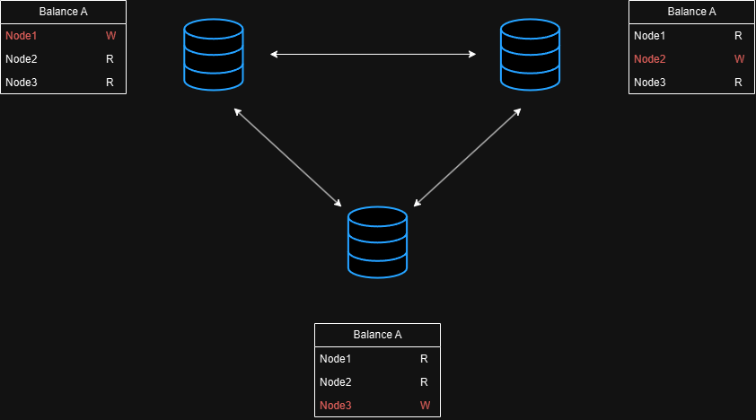
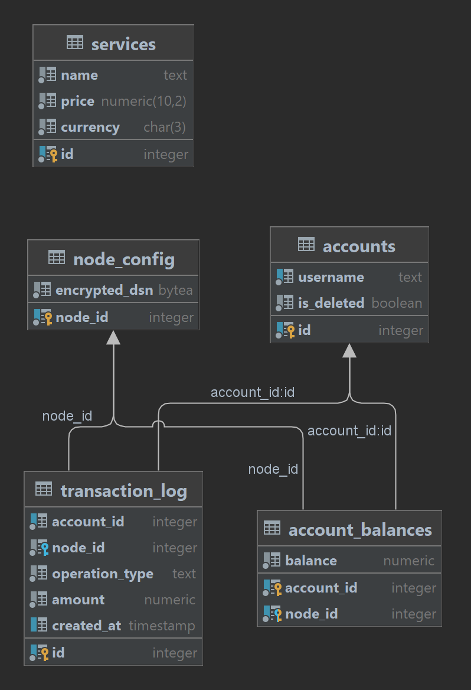

# geo-distributed-billing

**Геораспределенный биллинг** - система для управления балансами и транзакциями в геораспределенной инфраструктуре.

- **Аудитория**: Компании, использующие распределенные датацентры для обслуживания клиентов.
- **Использование**: Учет балансов, проведение транзакций.

## Архитектура системы

Баланс пользователя делится на части. В каждом датацентре для каждого баланса хранится локальный баланс, который можно изменять (W), и данные баланса с других нод (R). Баланс пользователя - это суммарный баланс со всех ЦОДов.

При изменении локального баланса на определенной ноде, благодаря репликации баланс изменяется и на друшгих датацентрах.

Такой подход позволяет ускорить время обработки каждого запроса, а в случае отключения датацентра, система продолжит работать.

## Требованеия

### Функциональные

- Ведение учетных записей.
- Сохранение балансов аккаунтов в разных датацентрах.
- Синхронизация общих данных между датацентрами (информация об аккаунтах, услугах, ценах).
- Обработка Pay In транзакций в асинхронном режиме.
- Обработка Pay Out транзакций, включая синхронные междатацентровые переводы при нехватке средств.
- Ведение истории транзакций.

### Нефункциональные

- Максимальная скорость ответа (это важно только для pay-in-транзакций).
- Синхронный контроль баланса (нужен контроль недопустимости отрицательного баланса).

### Органичения на данные

- В каждом датацентре должно быть n записей с балансом, где n - число нод. 
- Баланс аккаунта в любом датацентре не может быть отрицательным.

## Схема БД

Каждый датацентр содержит данную схему БД:

## Авторы
- [Александров Всеволод](https://github.com/Si6aClo)
- [Павлычев Артемий](https://github.com/linkartemy)
- [Шалаев Алексей](https://github.com/AlexeyShalaev)